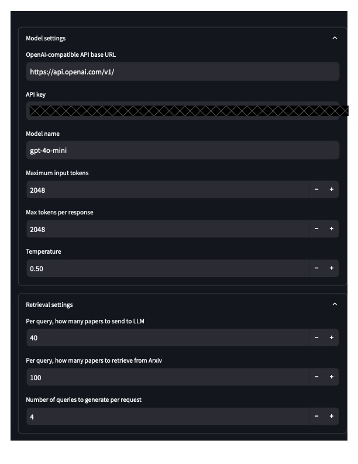
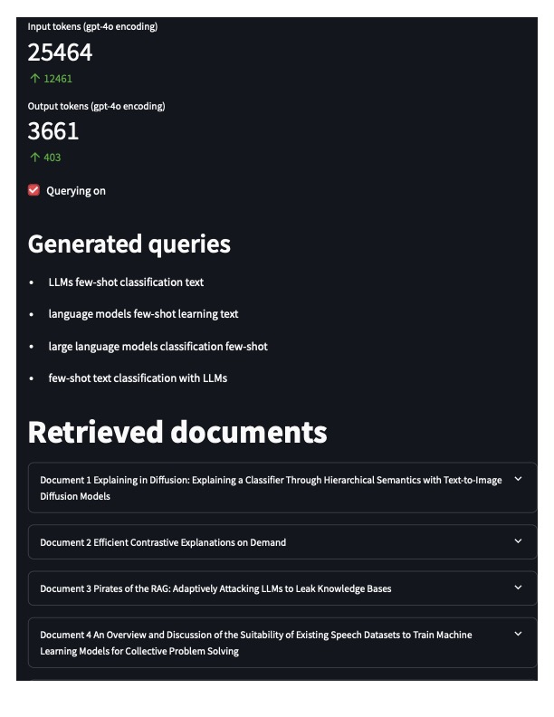
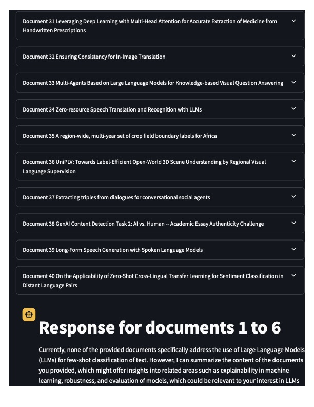
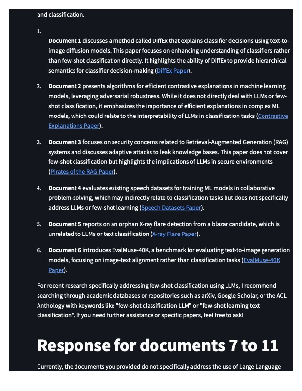
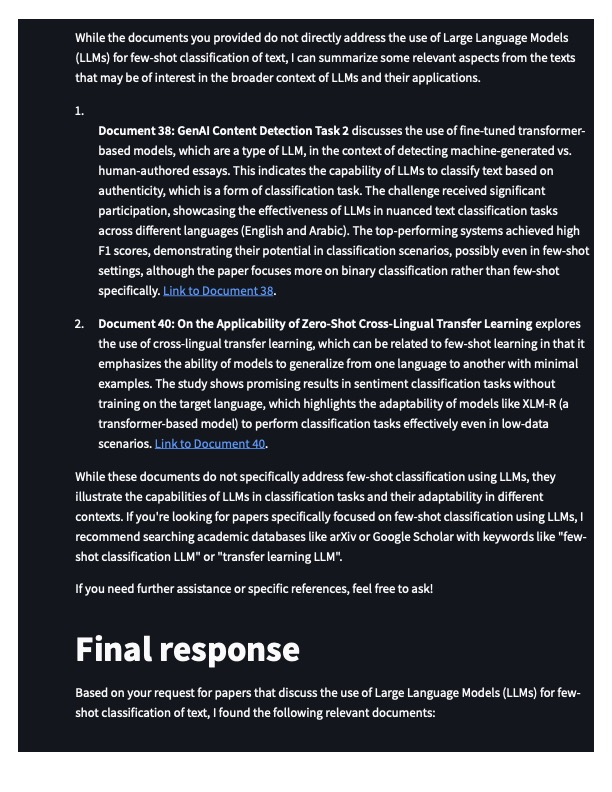
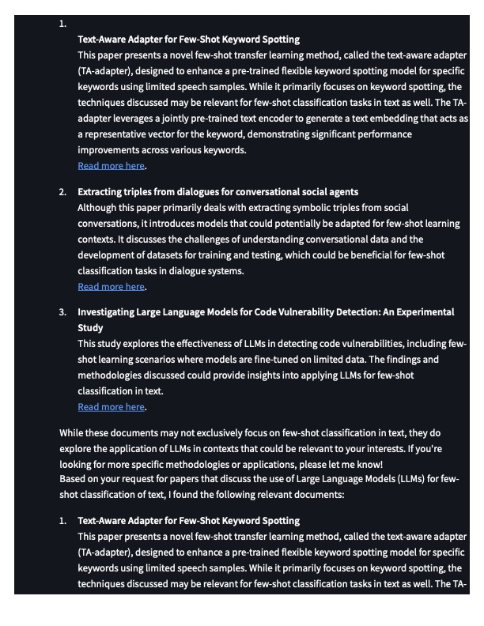
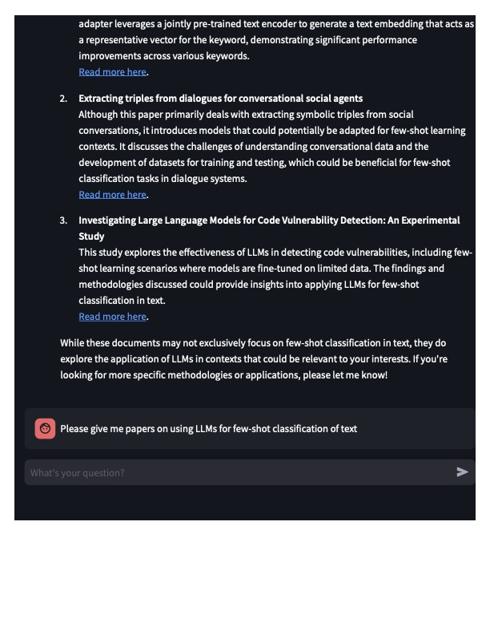

# Arxiv Assistant

I'm currently rewriting this using Streamlit to allow me to give users more customizability. Here are a few things that I'm trying to improve over the last iteration:

- Pick which LLM you want to infer from
- From the UI, select how many papers you want to retrieve
- Disable or enable retrieving more papers

## Known issues
- If your "Maximum input tokens" is smaller than the size of one abstract, there can be issues. 

## Screenshots

